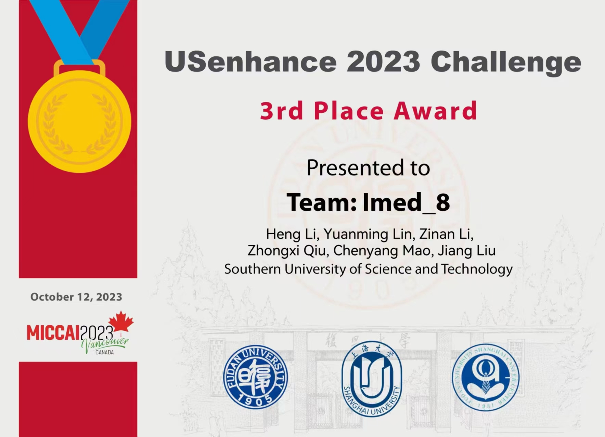
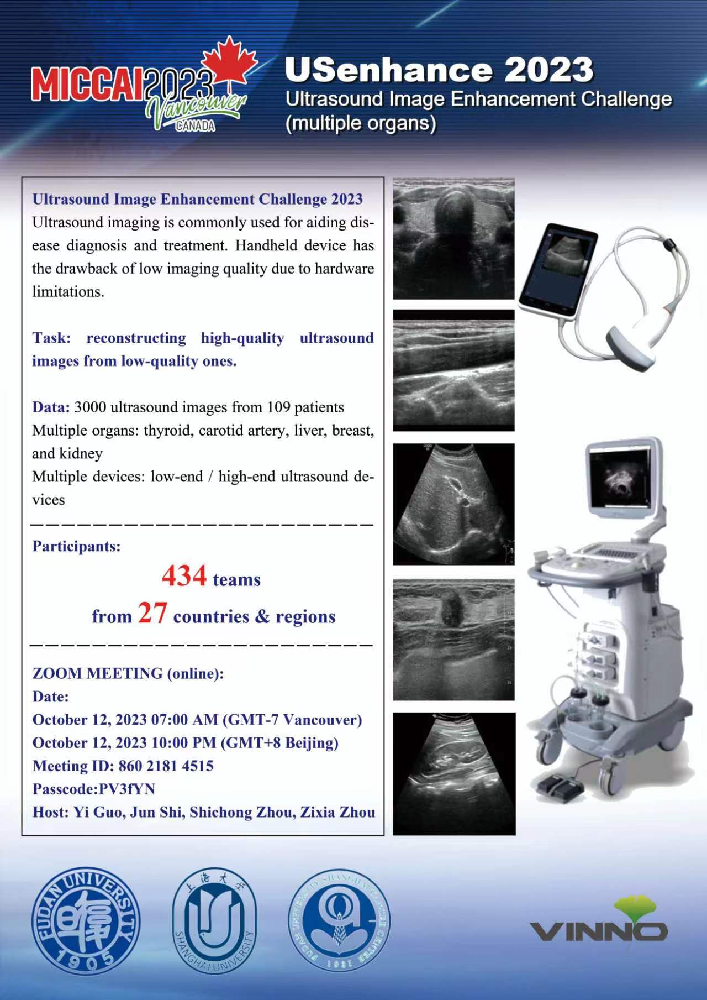
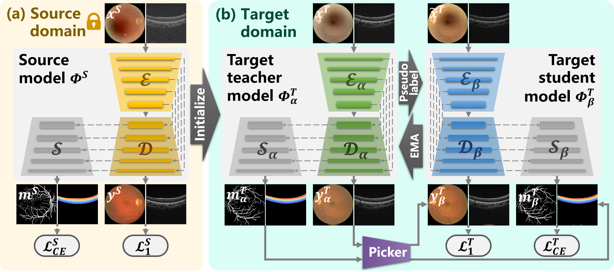

# Code for the 3rd Place Award of Ultrasound Image Enhancement Challenge (USenhance) 2023 in MICCAI
For the validation phase, we used GFE-Net, the method we proposed in A Generic Fundus Image Enhancement Network Boosted by Frequency Self-supervised Representation Learning [[More info]](https://github.com/liamheng/Annotation-free-Fundus-Image-Enhancement) [[arXiv]](https://arxiv.org/abs/2206.04684). 

For the test phase, we proposed a structure-preserving medical image enhancement (SPME) method based on unpaired training.
<center>

</center>

# Enhancing and Adapting in the Clinic: Source-free Unsupervised Domain Adaptation for Medical Image Enhancement
We propose an algorithm for Source-free unsupervised domain adaptive medical image enhancement (SAME), which adapts and optimizes enhancement models using test data in the inference phase.

# Enhancing and Adapting in the Clinic: Source-free Unsupervised Domain Adaptation for Medical Image Enhancement
In this paper, we raise an algorithm for source-free unsupervised domain adaptive medical image enhancement(SAME), which adapts and optimizes enhancement models using test data in the inference phase. Referring to [[arXir]](https://arxiv.org/pdf/2312.01338.pdf).


Here is the citation information:

```
@article{li2023enhancing,
  title={Enhancing and Adapting in the Clinic: Source-free Unsupervised Domain Adaptation for Medical Image Enhancement},
  author={Li, Heng and Lin, Ziqin and Qiu, Zhongxi and Li, Zinan and Niu, Ke and Guo, Na and Fu, Huazhu and Hu, Yan and Liu, Jiang},
  journal={IEEE Transactions on Medical Imaging},
  year={2023},
  publisher={IEEE}
}
```

# Prerequisites

\- Win10

\- Python 3

\- CPU or NVIDIA GPU + CUDA CuDNN

# Environment (Using conda)

```
conda install numpy pyyaml mkl mkl-include setuptools cmake cffi typing opencv-python

conda install pytorch torchvision -c pytorch # add cuda90 if CUDA 9

conda install visdom dominate -c conda-forge # install visdom and dominate
```

# Visualization when training

python -m visdom.server

# To open this link in the browser

http://localhost:8097/


# Command to run

Please note that root directory is the project root directory.

## Train

For GFE-Net:

```
python train.py --dataroot ./datasets/ultrasound --name train_ultrasound_stillgan_twolow --eval_test --num_test 202-- gpu_ids 5 --test_when_train --test_freq 2 --display_id 430810 --batch_size 2 --model still_gan_scr --input_nc 1 --output_nc 1 --direction AtoB --dataset_mode Ultrasound_stillgan --lr_policy linear --n_epochs 200 --n_epochs_decay 100 --test_when_train --display_port 9013 --lr 0.001 --netG unet_combine_2layer
```

For SPME:

```
python train.py --dataroot ./datasets/ultrasound --name train_ultrasound_stillgan_twolow --eval_test --num_test 202-- gpu_ids 5 --test_when_train --test_freq 2 --display_id 430810 --batch_size 2 --model still_gan --input_nc 1 --output_nc 1 --direction AtoB --dataset_mode Ultrasound_stillgan --lr_policy linear --n_epochs 200 --n_epochs_decay 100 --test_when_train --display_port 9013 --lr 0.001
```

For SAME:

Before the training, you need to place the [EyeQ](https://1drv.ms/u/s!Aoi-8GJo2S51kH5vxrzTzzIy4S6b?e=hcwJhB) into /pretrain/, and place the [source_checkpoint_S](https://1drv.ms/u/s!Aoi-8GJo2S51kH-p8Wtq5h5XtW90?e=necre4), [source_checkpoint_T](https://1drv.ms/u/s!Aoi-8GJo2S51kQAJY6bilCKuabHj?e=PI1WtS) into /pretrain/04_17_newDrive_unet_combine_2layer_L1_5_dropout_withTanh_lamda=0.95_bs=4_addbias.

```
python train_KD.py  --dataroot ./datasets/FIQ --name newdata_FIQ_unet_combine_2laye_L1_5_no_dropout_withTanh_KD_entropy=1_ema=0.995_bs=4_addbias --model SDA_KD --netG unet_combine_2layer --input_nc 3 --output_nc 1 --direction AtoB --dataset_mode FIQ
--norm instance --batch_size 4 --lr_policy linear --n_epochs 150 --n_epochs_decay 50 --gpu_ids 5 --display_id 4101130 --test_dataset_mode FIQ --pre_model --num_threads 4 --display_port 8099 --is_fiq --lambda_l1 0.9 --lambda_cl 0.1
```


## Test & Visualization

For GFE-Net:

```
python test_stillgan.py --dataroot ./datasets/ultrasound --name train_ultrasound_stillgan_twolow --model still_gan_singlescr --input_nc 1 --output_nc 1 --direction AtoB --dataset_mode Ultrasound_stillgan --norm instance -- batch_size 8 --gpu_ids 6 --no_dropout -- postname last --netG unet_combine_2layer
```

For SPME:

```
python test_stillgan.py --dataroot ./datasets/ultrasound --name train_ultrasound_stillgan_twolow --model still_gan --input_nc 1 --output_nc 1 --direction AtoB --dataset_mode Ultrasound_stillgan --norm instance -- batch_size 8 --gpu_ids 6 --no_dropout -- postname last --netG resunet
```

For SAME:

```
python test.py  --dataroot ./datasets/FIQ --name newdata_FIQ_unet_combine_2laye_L1_5_no_dropout_withTanh_KD_entropy=1_ema=0.995_bs=4_addbias --model SDA_KD --netG unet_combine_2layer --input_nc 3 --output_nc 1 --direction AtoB --dataset_mode FIQ --norm instance
--batch_size 8 --gpu_ids 2 --no_dropout --test_name fiq_test --target_gt_dir gt --is_fiq
```


## Trained model's weight

**Note:** If you want to use SAME in your own dataset, please re-train a new model with your own data, because it is a method based on domain adaptation, which means it needs target data (without ground truth) in the training phase.

For the model of SAME 'Enhancing and Adapting in the Clinic: Test-time Adaptation for Medical Image Enhancement' please download the pretrained model and place the document based on the following table:

|        | Baidu Cloud                                                  | Google Cloud                                                 | Directory                                        |
| ------ | ------------------------------------------------------------ | ------------------------------------------------------------ | ------------------------------------------------ |
| GFE-Net | Coming soon                                                  | Coming soon                                                  | project_root/checkpoints/GFE-Net/latest_net_G.pth |
| SPME | Coming soon                                                  | [oneDrive](https://1drv.ms/u/s!Aoi-8GJo2S51kGPbCGhBpXwwAk1D?e=X2CKAr)                                                  | project_root/checkpoints/SPME/latest_net_G.pth |
| SAME | Coming soon                                                  | [oneDrive](https://1drv.ms/u/s!Aoi-8GJo2S51kH-p8Wtq5h5XtW90?e=necre4) [oneDrive](https://1drv.ms/u/s!Aoi-8GJo2S51kQAJY6bilCKuabHj?e=PI1WtS)                                                   | project_root/pretrain/04_17_newDrive_unet_combine_2layer_L1_5_dropout_withTanh_lamda=0.95_bs=4_addbias/latest_net_S.pth AND project_root/pretrain/04_17_newDrive_unet_combine_2layer_L1_5_dropout_withTanh_lamda=0.95_bs=4_addbias/latest_net_T.pth|
| SAME | Coming soon                                                  | [oneDrive](https://1drv.ms/u/s!Aoi-8GJo2S51kH7axGN9ALDJ9pOA?e=g0zgn5) | project_root/pretrain/DenseNet121_v3_v1.tar |

# Citation

```
@inproceedings{li2022structure,
  title={Structure-consistent restoration network for cataract fundus image enhancement},
  author={Li, Heng and Liu, Haofeng and Fu, Huazhu and Shu, Hai and Zhao, Yitian and Luo, Xiaoling and Hu, Yan and Liu, Jiang},
  booktitle={International Conference on Medical Image Computing and Computer-Assisted Intervention},
  pages={487--496},
  year={2022},
  organization={Springer}
}
```
